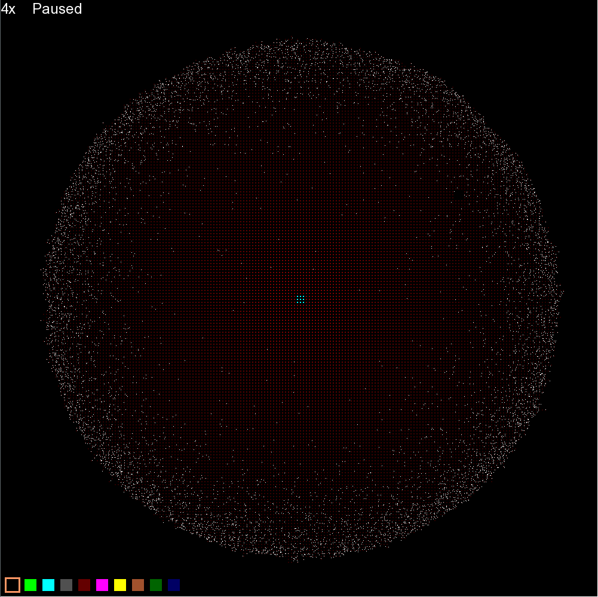
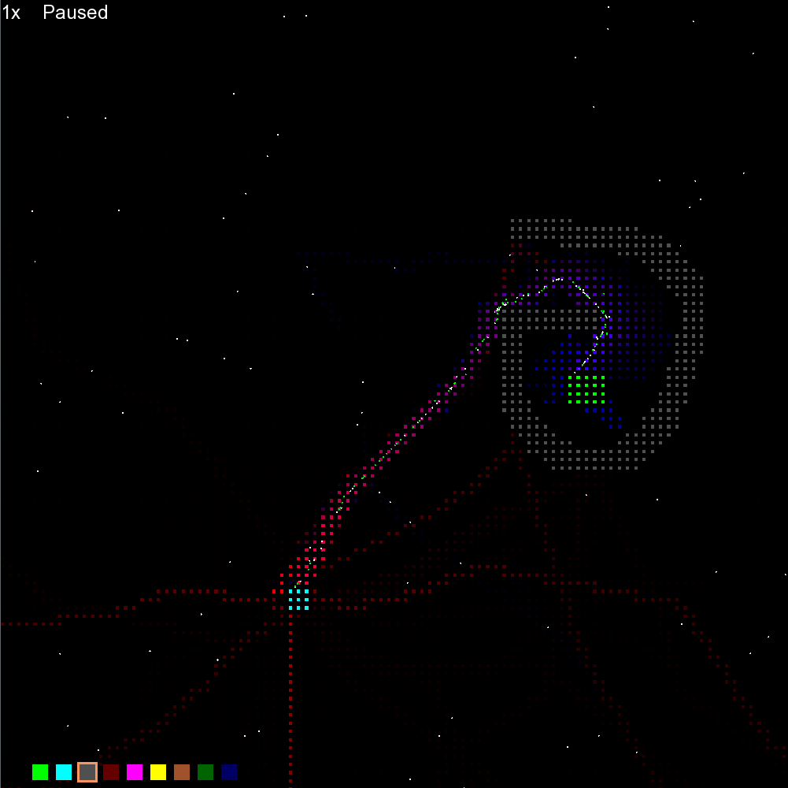

# Game of Life
A simulation framework inspired by Conway's Game of Life. The world is grid based, but agents in the world move continuously, reacting to properties of the tiles they are on according to user defined rules.

## Ant colony example

